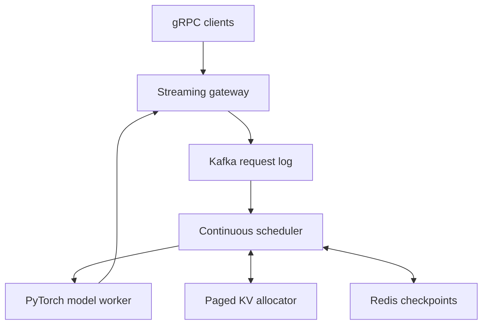

# Continuous-Batching LLM Inference Server

[](https://github.com/sravani150602/continuous-batching-llm/actions/workflows/ci.yml)
[](LICENSE)

A production-oriented inference control plane demonstrating the systems behind modern LLM serving: iteration-level continuous batching, logical paged KV-cache allocation, priority preemption, prefix reuse, durable Kafka orchestration, Redis checkpoints, and token streaming.

**Built by [Sravani Elavarthi](https://github.com/sravani150602)**  
Data Science M.S. graduate and software engineer focused on scalable backend, distributed systems, and machine-learning infrastructure.

> The included deterministic backend makes scheduler behavior reproducible in CI. The optional PyTorch/Hugging Face backend performs real causal language-model inference. Benchmark numbers must be generated on the target hardware; this repository does not hard-code unverified performance claims.

## Architecture



At every decoding iteration, completed sequences leave and newly admitted sequences join the active batch. This avoids waiting for the longest request in a static batch. KV blocks are allocated in fixed-size pages, so sequences grow without reserving a contiguous worst-case buffer.

## What is implemented

- Priority-aware continuous batching with token and sequence budgets
- Fixed-page KV-cache allocator with ownership tracking and LRU prefix metadata
- Memory-pressure preemption and request re-queuing
- Async token-by-token streaming interface
- Real PyTorch/Transformers backend plus deterministic test backend
- Redis request checkpoint adapter and Kafka event/request producer
- Protobuf streaming API contract
- C++20 scheduler core with an independent test target
- Docker Compose stack, Python/C++ CI, linting, tests, and benchmark harness

## Quick start

```bash
python -m venv .venv
source .venv/bin/activate
make install
make test
make demo
```

Run real local model inference (a GPU is used when available):

```bash
pip install -e '.[model]'
python -m llm_server.main --backend torch --model distilgpt2 "The future of inference is"
```

Start infrastructure and the service container:

```bash
docker compose up --build
```

## Benchmarking

```bash
PYTHONPATH=src python benchmarks/run_benchmark.py \
  --concurrency 32 --requests 500 --output-tokens 64
```

The harness reports token throughput, p50/p99 time-to-first-token, and p99 end-to-end latency as JSON. For an honest static-vs-continuous comparison, use the same backend, prompts, output lengths, warm-up, concurrency, and latency constraint on the same machine.

## Repository map

```text
cpp/             C++20 latency-sensitive scheduler
proto/           versioned gRPC service contract
src/llm_server/  engine, scheduler, cache, backends, state and orchestration
tests/           allocator, priority and concurrent-engine tests
benchmarks/      reproducible load harness
.github/         Python, C++ and container CI
```

## Production hardening roadmap

- Bind the C++ scheduler through pybind11 and replace logical page IDs with CUDA tensor blocks
- Generate gRPC stubs in the image and add authentication, quotas, cancellation, and backpressure
- Use consumer groups and idempotency keys for at-least-once Kafka delivery
- Store KV tensors in GPU memory; Redis should hold resumable metadata, never large tensors
- Export queue depth, batch occupancy, page fragmentation, TTFT, TPOT, and preemption metrics
- Add multi-GPU tensor/pipeline parallel workers and an admission-control router

## Resume-safe performance language

Only claim results you reproduce. After running controlled benchmarks, record the hardware, model, quantization, prompt/output distributions, concurrency, warm-up, and raw result files. This makes throughput and p99 claims defensible in interviews.

## License

MIT © 2026 Sravani Elavarthi
