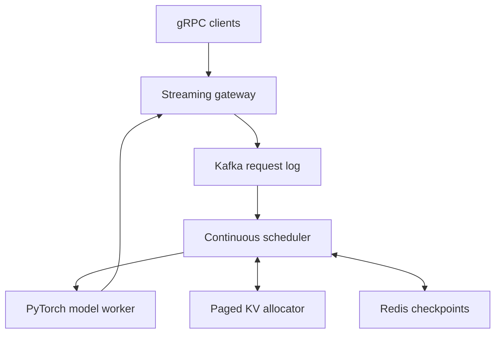
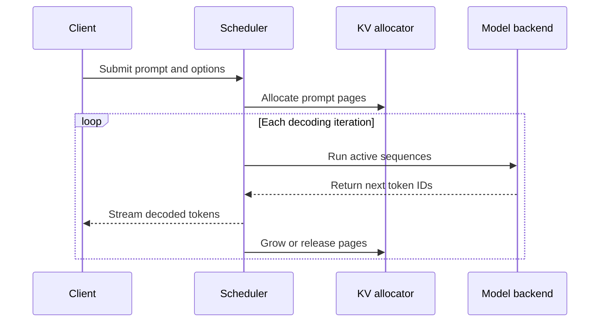

# Continuous-Batching LLM Inference Server

[](https://github.com/sravani150602/continuous-batching-llm-inference-server/actions/workflows/ci.yml)
[](LICENSE)

A production-oriented inference control plane demonstrating the systems behind modern LLM serving: iteration-level continuous batching, logical paged KV-cache allocation, priority preemption, prefix reuse, durable Kafka orchestration, Redis checkpoints, and token streaming. The project separates scheduling, model execution, memory management, transport, and infrastructure concerns so each layer can be tested and evolved independently.

**Built by [Sravani Elavarthi](https://github.com/sravani150602)**  
Data Science M.S. graduate and software engineer focused on scalable backend, distributed systems, and machine-learning infrastructure.

> The included deterministic backend makes scheduler behavior reproducible in CI. The optional PyTorch/Hugging Face backend performs real causal language-model inference. Benchmark numbers must be generated on the target hardware; this repository does not hard-code unverified performance claims.

## Why this project exists

Traditional static batching groups requests and waits until every sequence in that batch finishes. Since LLM requests have different prompt and output lengths, short requests can sit idle behind long ones. Static allocation also reserves large contiguous KV-cache regions, which wastes GPU memory and limits concurrency.

This server models the techniques used to address those problems:

- **Continuous batching:** the scheduler rebuilds the active batch after every decoding step. Finished requests leave immediately and waiting requests can enter without waiting for an entire batch to drain.
- **Paged KV-cache allocation:** sequence state grows in fixed-size logical pages instead of one worst-case contiguous allocation.
- **Priority scheduling and preemption:** urgent work is admitted first, and lower-priority work can yield its pages during memory pressure.
- **Prefix metadata caching:** repeated prompt prefixes can be detected and tracked for reuse by a tensor-backed implementation.
- **Durable orchestration:** Kafka adapters provide ordered request and lifecycle-event publication, while Redis stores resumable request metadata.
- **Streaming delivery:** the engine exposes generated tokens asynchronously, and the versioned protobuf contract defines server-streaming gRPC delivery.

## Technology stack

| Layer | Technology | Responsibility |
|---|---|---|
| Scheduling core | Python, C++20 | Admission control, priorities, token budgets, active-batch formation |
| Model execution | PyTorch, Transformers | Causal language-model loading and next-token selection |
| Memory control | Paged KV allocator | Logical page ownership, growth, release, and prefix metadata |
| Request transport | Protocol Buffers, gRPC contract | Versioned request schema and token-streaming API |
| Messaging | Kafka | Durable request ingestion and lifecycle events |
| State | Redis | Request checkpoints used for recovery and preemption metadata |
| Packaging | Docker, Docker Compose | Reproducible service, Kafka, and Redis environment |
| Quality | Pytest, Ruff, CTest, GitHub Actions | Automated Python, C++, lint, and container verification |

## Architecture



At every decoding iteration, completed sequences leave and newly admitted sequences join the active batch. This avoids waiting for the longest request in a static batch. KV blocks are allocated in fixed-size pages, so sequences grow without reserving a contiguous worst-case buffer.

### Request lifecycle



1. A request receives a unique ID, prompt, output limit, temperature, and priority.
2. The backend tokenizes the prompt and the allocator reserves only the pages currently needed.
3. The priority scheduler admits the request when both sequence-count and token budgets permit it.
4. The model backend executes one decoding iteration for all active sequences.
5. Each generated token is placed on the request's asynchronous output queue immediately.
6. Finished sequences release their pages; waiting sequences can join the next iteration.
7. Under memory pressure, a lower-priority request can be preempted, checkpointed, and re-queued.

## What is implemented

- Priority-aware continuous batching with token and sequence budgets
- Fixed-page KV-cache allocator with ownership tracking and LRU prefix metadata
- Memory-pressure preemption and request re-queuing
- Async token-by-token streaming interface
- Real PyTorch/Transformers backend plus deterministic test backend
- Redis request checkpoint adapter and Kafka event/request producer
- Protobuf streaming API contract
- C++20 scheduler core with an independent test target
- Docker Compose stack, Python/C++ CI, linting, tests, and benchmark harness

## Design details

### Continuous-batching scheduler

`PriorityScheduler` maintains a heap ordered by request priority and FIFO arrival order. `form_batch()` begins with eligible running requests and admits waiting requests until either `max_batch_size` or `max_batch_tokens` is reached. The engine invokes this decision for every token-generation iteration, which is the central difference from static batching.

The equivalent C++20 scheduler demonstrates how latency-sensitive scheduling logic can move out of Python. Its independent CMake/CTest target verifies priority ordering without requiring Python, a model download, or a GPU.

### Paged KV-cache allocator

`PagedKVCache` maintains a free-page list and explicit page ownership. It supports:

- calculating pages from token counts;
- allocating pages to a request;
- extending a sequence as it grows;
- releasing all pages safely when a request finishes;
- rejecting allocations that exceed capacity;
- recording and locating the longest known prompt prefix.

The current allocator models control-plane behavior with logical page IDs. A production CUDA implementation would map those IDs to preallocated key/value tensor blocks and maintain reference counts for shared prefixes.

### Model backends

The server exposes a small `ModelBackend` interface with `encode`, `decode`, and asynchronous `step` methods.

- `DeterministicBackend` is dependency-light and predictable. It is used for scheduler tests, CI, and repeatable control-plane benchmarks.
- `TorchBackend` lazily loads a Hugging Face causal language model, runs it under `torch.inference_mode()`, selects the next token, and falls back to CPU when CUDA is unavailable.

This separation lets infrastructure and scheduling tests run without downloading model weights.

### Kafka and Redis

`KafkaOrchestrator` publishes keyed JSON messages to request and lifecycle-event topics. Using `request_id` as the Kafka message key keeps events for one request ordered within a partition.

`RedisStateStore` checkpoints the prompt, generated token IDs, priority, and state with a configurable TTL. Redis contains recovery metadata—not GPU KV tensors. Large tensor state should remain in the model worker or a specialized distributed cache.

### Streaming API

`proto/inference.proto` defines:

- `Generate`, a server-streaming RPC;
- `Health`, a health/readiness RPC;
- request ID, prompt, maximum output tokens, temperature, and priority;
- token text, token ID, completion state, and sequence number.

The engine's asynchronous generator is the transport-independent streaming primitive. Generated gRPC bindings and authentication middleware are intentionally listed under production hardening rather than represented as complete production networking code.

## Quick start

```bash
python -m venv .venv
source .venv/bin/activate
make install
make test
make demo
```

Example deterministic output:

```text
prompt: Continuous batching
response: qyvm...
prompt: Paged attention
response: kfzs...
```

The deterministic characters are not natural-language output; they make scheduling behavior fast and reproducible. Use the PyTorch backend for real model output.

Run real local model inference (a GPU is used when available):

```bash
pip install -e '.[model]'
python -m llm_server.main --backend torch --model distilgpt2 "The future of inference is"
```

Start infrastructure and the service container:

```bash
docker compose up --build
```

Docker Compose starts:

- the inference container;
- Redis 7 with a health check and lightweight persistence;
- a single-node Kafka broker suitable for development.

## Configuration

The server reads configuration from environment variables.

| Variable | Default | Meaning |
|---|---:|---|
| `MAX_BATCH_SIZE` | `32` | Maximum active sequences per decoding iteration |
| `MAX_BATCH_TOKENS` | `2048` | Total in-memory token budget for one active batch |
| `KV_PAGES` | `1024` | Logical KV pages available to the allocator |
| `KV_PAGE_SIZE` | `16` | Tokens represented by one logical page |
| `SCHEDULER_TICK_MS` | `5` | Idle scheduler polling interval |
| `PREEMPTION_ENABLED` | `true` | Whether memory pressure can preempt a request |
| `REDIS_URL` | `redis://localhost:6379/0` | Redis checkpoint connection |
| `KAFKA_BOOTSTRAP_SERVERS` | `localhost:9092` | Kafka broker list |

Example:

```bash
MAX_BATCH_SIZE=16 KV_PAGES=2048 SCHEDULER_TICK_MS=2 \
python -m llm_server.main "Explain continuous batching"
```

## Benchmarking

```bash
PYTHONPATH=src python benchmarks/run_benchmark.py \
  --concurrency 32 --requests 500 --output-tokens 64
```

The harness reports token throughput, p50/p99 time-to-first-token, and p99 end-to-end latency as JSON. For an honest static-vs-continuous comparison, use the same backend, prompts, output lengths, warm-up, concurrency, and latency constraint on the same machine.

Example result format:

```json
{
  "requests": 500,
  "concurrency": 32,
  "throughput_tokens_per_second": 6120.4,
  "ttft_p50_ms": 18.7,
  "ttft_p99_ms": 31.2,
  "latency_p99_ms": 414.8
}
```

These values are illustrative schema examples, not claimed hardware results.

### Validating résumé metrics

To claim a throughput multiplier or TTFT reduction responsibly:

1. Select and document the model, GPU, precision, framework versions, and page size.
2. Warm the model before recording results.
3. Use the same prompt distribution, output-length distribution, concurrency, and request count for each experiment.
4. Compare continuous and static scheduling at an equivalent p99-latency constraint.
5. Compare cold prefixes with repeated prefixes to measure caching impact.
6. Repeat each experiment and report the median run plus raw JSON artifacts.
7. Only place `3.2×` or `640 ms → 185 ms` on a résumé if those values are reproduced by that documented experiment.

## Testing and verification

Run the complete local Python verification:

```bash
ruff check src tests benchmarks
pytest -q
```

Run the C++ test target:

```bash
cmake -S . -B build -DCMAKE_BUILD_TYPE=Release
cmake --build build --parallel
ctest --test-dir build --output-on-failure
```

The test suite covers:

- page allocation and full release;
- out-of-memory page rejection;
- longest-prefix lookup;
- priority and batch-size enforcement;
- concurrent token streaming;
- request completion states;
- page reclamation after all requests finish.

Every push runs three GitHub Actions jobs:

1. **Python:** install, Ruff, and Pytest.
2. **C++:** configure, compile, and CTest.
3. **Docker:** BuildKit image construction without publishing.

## Repository map

```text
cpp/             C++20 latency-sensitive scheduler
proto/           versioned gRPC service contract
src/llm_server/  engine, scheduler, cache, backends, state and orchestration
tests/           allocator, priority and concurrent-engine tests
benchmarks/      reproducible load harness
.github/         Python, C++ and container CI
```

## Engineering trade-offs

| Decision | Benefit | Trade-off |
|---|---|---|
| Rebuild the batch each iteration | Fast admission of newly arrived work | More scheduler activity |
| Fixed-size KV pages | Less fragmentation and easier growth | Page-table bookkeeping and possible final-page waste |
| Priority plus FIFO ordering | Predictable urgent-request handling | Requires starvation controls in long-running systems |
| Redis metadata checkpoints | Simple recovery and inspection | Network overhead; unsuitable for large tensors |
| Kafka request log | Durable, partitioned orchestration | Additional operational complexity and delivery semantics |
| Separate deterministic backend | Fast, reliable CI | Does not represent real GPU kernel performance |
| Python control plane plus C++ scheduler | Fast development and a native optimization path | Cross-language bindings are future work |

## Production hardening roadmap

- Bind the C++ scheduler through pybind11 and replace logical page IDs with CUDA tensor blocks
- Generate gRPC stubs in the image and add authentication, quotas, cancellation, and backpressure
- Use consumer groups and idempotency keys for at-least-once Kafka delivery
- Store KV tensors in GPU memory; Redis should hold resumable metadata, never large tensors
- Export queue depth, batch occupancy, page fragmentation, TTFT, TPOT, and preemption metrics
- Add multi-GPU tensor/pipeline parallel workers and an admission-control router

## Known limitations

- The KV allocator manages logical pages; it does not yet move real PyTorch KV tensors between GPU blocks.
- Prefix entries demonstrate lookup and eviction metadata; production tensor sharing needs reference counting and copy-on-write behavior.
- The protobuf service contract is present, while generated gRPC bindings, authentication, quotas, cancellation propagation, and network backpressure remain hardening work.
- Kafka and Redis adapters are isolated components rather than a fully transactional end-to-end recovery workflow.
- The included benchmark focuses on scheduler behavior and is not a substitute for a controlled GPU benchmark using a production model.
- The PyTorch backend recomputes sequence context and is intentionally simpler than optimized fused-attention runtimes.

## Troubleshooting

### `ModuleNotFoundError: llm_server`

Install the project in editable mode with `pip install -e '.[dev]'`, or set `PYTHONPATH=src` for direct benchmark execution.

### PyTorch uses CPU

Confirm that `torch.cuda.is_available()` returns `True` and that the installed PyTorch build matches the system CUDA version. The backend deliberately falls back to CPU instead of failing startup.

### Kafka or Redis connection failures

Start the infrastructure with `docker compose up redis kafka` and confirm that `REDIS_URL` and `KAFKA_BOOTSTRAP_SERVERS` point to the correct hostnames for the calling environment.

### KV pages are exhausted

Increase `KV_PAGES`, reduce `MAX_BATCH_SIZE` or `MAX_BATCH_TOKENS`, shorten request limits, or enable preemption. Production deployments should also expose allocator pressure and fragmentation metrics.

## Interview discussion guide

Be prepared to explain:

- why static batching suffers head-of-line blocking;
- how iteration-level scheduling improves GPU utilization;
- how paging reduces KV-cache fragmentation;
- how token budgets differ from request-count limits;
- which request should be preempted and how starvation can be prevented;
- why Redis stores metadata rather than GPU tensors;
- how Kafka keys preserve per-request ordering;
- how cancellation and backpressure should propagate through gRPC;
- how you would benchmark throughput without hiding a p99-latency regression;
- what must change to support multiple GPUs and tensor parallelism.

## Resume-safe performance language

Only claim results you reproduce. After running controlled benchmarks, record the hardware, model, quantization, prompt/output distributions, concurrency, warm-up, and raw result files. This makes throughput and p99 claims defensible in interviews.

Suggested verified wording before hardware-specific results are available:

> Built a CI-tested LLM inference control plane with continuous batching, priority scheduling, logical paged KV-cache allocation, request preemption, Redis checkpoints, Kafka lifecycle orchestration, a PyTorch model backend, and a versioned streaming gRPC contract.

## Contributing

1. Create a focused branch.
2. Add or update tests with the implementation.
3. Run Ruff, Pytest, and CTest locally.
4. Document any benchmark environment and attach raw results.
5. Open a pull request describing behavior, trade-offs, and validation.

## Author

**Sravani Elavarthi**  
GitHub: [@sravani150602](https://github.com/sravani150602)

## License

MIT © 2026 Sravani Elavarthi
